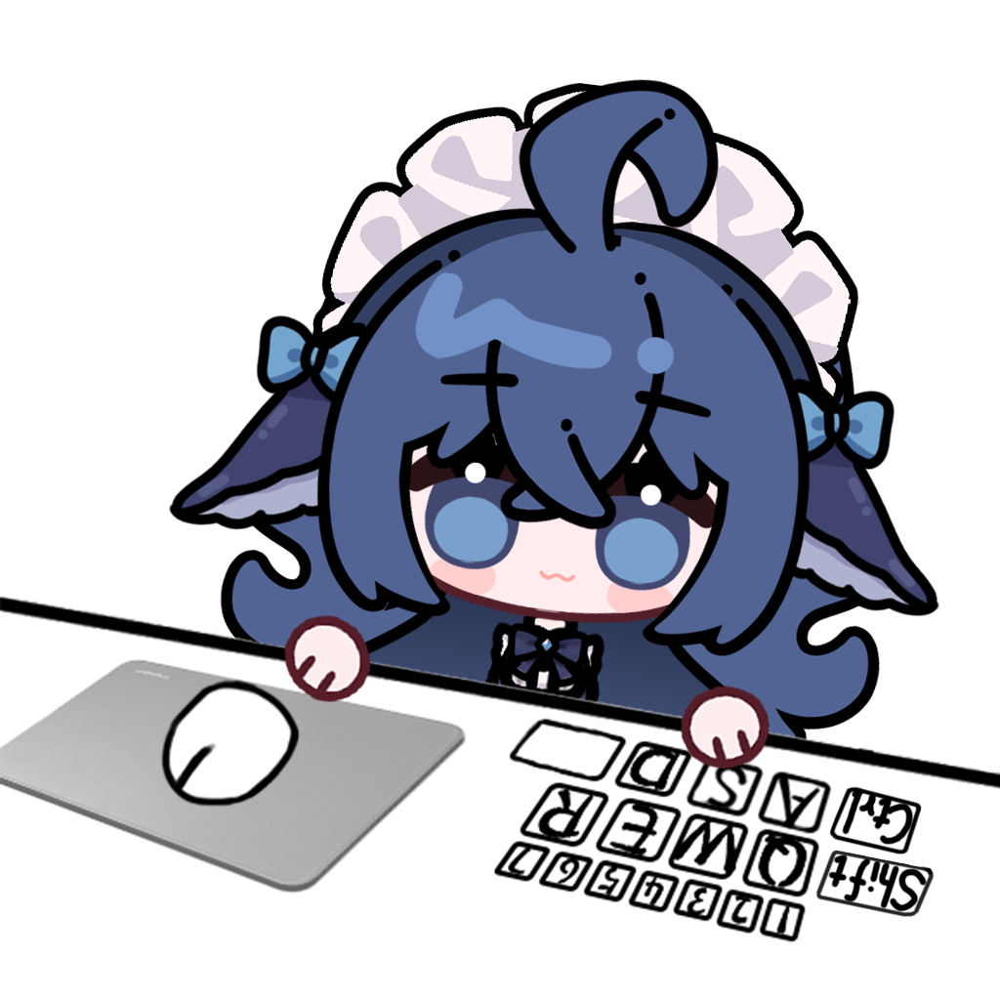

# BongoCat deepseek桌宠 

## 项目简介

一个 [BongoCat](https://bongocat.pet/) 的自定义角色资源包。

> 注意：当前仓库主要提供 **模型与素材资源**，并 **不包含完整的桌宠运行程序**。\
> 实际运行请配合 [BongoCat](https://bongocat.pet/) 使用。

\
角色：**deepseek蓝色大肥鱼**\
立绘来源：**[赤风RED](https://www.bilibili.com/video/BV1V88G6TEvg/?)  &  [EmoteLab](https://store.steampowered.com/app/4301100/EmoteLab/)**\
使用教程：[mefist](https://www.bilibili.com/video/BV1bWaq6NEEV/?)

## 包含内容

### 1. Live2D 模型文件

- `deepseek.model3.json`：模型入口配置文件
- `deepseek.moc3`：Live2D 模型核心文件
- `deepseek.cdi3.json`：显示信息与参数说明文件
- `deepseek.physic3.json`： Live2D 物理演算配置文件
- `deepseek.4096/texture_00.png`：Live2D 模型贴图
- `*.exp3.json`：表情/配件切换配置文件（盆、眼镜、便签、彩蛋）
- `*.motion3.json`：动作配置文件（惊讶、打招呼、冒爱心、流汗）

### 2. 项目资源文件

- `resources/cover.png`：展示封面
- `resources/left-keys/`：左侧按键图片资源
- `*.mp3`：动作音效（惊讶、打招呼）

> 注意：如果您想要 **删除动作音效**， **直接删除mp3文件**即可。

当前已包含的按键素材如下：

- `W / A / S / D`
- `Q / E / R`
- `1 / 2 / 3 / 4 / 5 / 6 / 7`
- `Shift / Ctrl / Space`

## 特别鸣谢
-感谢 [阿特ers](https://www.bilibili.com/video/BV11rT164EWC/?) 开源的Bongocat项目文件和PSD工程文件，这给了我很多的帮助和参考；
-感谢 [赤风RED](https://www.bilibili.com/video/BV1V88G6TEvg/?) 分享的Emotelab角色配置文件，帮助我快速还原出蓝色大肥鱼；
-感谢 [常日缠](https://www.bilibili.com/video/BV17utZ6hE64/?) 开源的psd2live工具，帮助我省去了大半live2D中布点和分层的准备工作。
